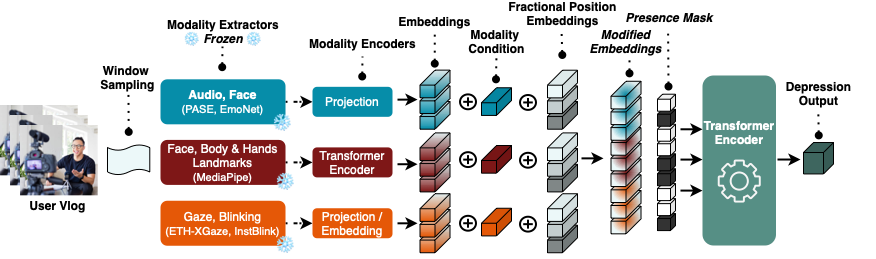
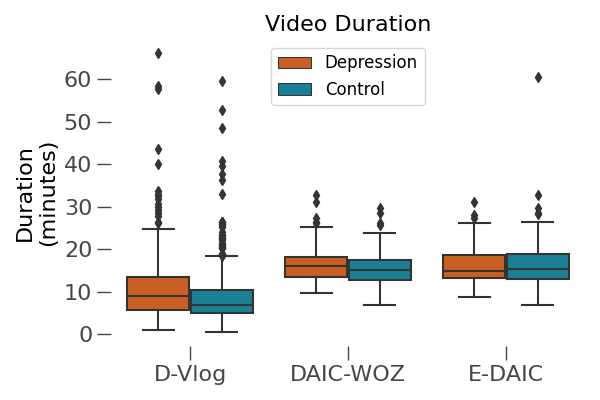
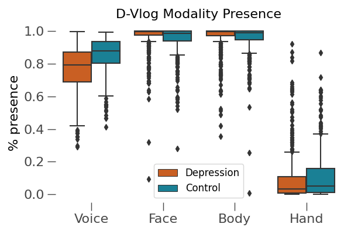

<h1 align="center"><span style="font-weight:normal">Reading Between the 🎞️ Frames:<br />Multi-Modal Depression Detection in Videos from Non-Verbal Cues</h1>


<div align="center">
  
[David Gimeno-Gómez](https://scholar.google.es/citations?user=DVRSla8AAAAJ&hl=en), [Ana-Maria Bucur](https://scholar.google.com/citations?user=TQuQ5IAAAAAJ&hl=en), [Adrian Cosma](https://scholar.google.com/citations?user=cdYk_RUAAAAJ&hl=en), [Carlos-D. Martínez-Hinarejos](https://scholar.google.es/citations?user=M_EmUoIAAAAJ&hl=en), [Paolo Rosso](https://scholar.google.es/citations?user=HFKXPH8AAAAJ&hl=en)
</div>

<div align="center">
  
[📘 Introduction](#intro) |
[🛠️ Data Preparation](#preparation) |
[💪 Training and Evaluation](#training) |
[📖 Citation](#citation) |
[📝 License](#license)
</div>

<div align="center">  </div>

## <a name="intro"></a> 📘 Introduction
*Depression, a prominent contributor to global disability, affects a substantial portion of the population. Efforts to detect depression from social media text have been prevalent, yet only a few works explored depression detection from user-generated video content. In this work, we address this research gap by proposing a simple and flexible multi-modal temporal model capable of discerning non-verbal depression cues from diverse modalities in noisy, real-world videos. We show that, for in-the-wild videos, using additional high-level non-verbal cues is crucial to achieve good performance, and we extracted and processed audio speech embeddings, face emotion embeddings, face, body and hand landmarks, and gaze and blinking information. Through extensive experiments, we show that our model achieves state-of-the-art results on three key benchmark datasets for depression detection from video by a substantial margin.*

## <a name="preparation"></a> 🛠️ Data Preparation

### Downloading the datasets

- For D-Vlog, the features extracted by the authors are publicly available [here](https://sites.google.com/view/jeewoo-yoon/dataset). Original vlog videos are available upon request. Please contact the original paper authors.

- For DAIC-WOZ and E-DAIC, the features are only available upon request [here](https://dcapswoz.ict.usc.edu/).

### Extracting non-verbal modalities from D-Vlog

#### D-Vlog

- To extract the audio embeddings:

```
conda create -y -n pase+ python=3.7
conda activate pase+
bash ./scripts/conda_envs/prepare_pase+_env.sh
bash ./scripts/features
scripts/feature_extraction/extract-dvlog-pase+-feats.sh
conda deactivate pase+
```

- To extract face, body, and hand landmarks:

```
conda create -y -n landmarks python=3.8
conda activate landmarks
bash scripts/conda_envs/prepare_landmarks_env.sh
scripts/feature_extraction/extract-dvlog-landmarks.sh
conda deactivate landmarks
```

- To extract face EmoNet embeddings:

```
conda create -y -n emonet python=3.8
conda activate emonet
bash ./scripts/conda_envs/prepare_emonet_env.sh
bash ./scripts/feature_extraction/extract-dvlog-emonet-feats.sh
conda deactivate emonet
```

- To extract gaze tracking:

```
conda create -y -n mpiigaze python=3.8
conda activate mpiigaze
bash ./scripts/conda_envs/prepare_mpiigaze_env.sh
bash ./scripts/feature_extraction/extract-dvlog-gaze-feats.sh
conda deactivate mpiigaze
```

- To extract blinking features:

```
conda create -y -n instblink python=3.7
conda activate instblink
bash ./scripts/conda_envs/prepare_instblink_env.sh
bash ./scripts/feature_extraction/extract-dvlog-blinking-feats.sh
conda deactivate instblink
```

#### DAIC-WOZ

- To pre-process the DAIC-WOZ features:

```
conda activate landmarks
bash ./scripts/feature_extraction/extract-daicwoz-features.sh
conda deactivate
```

#### E-DAIC
- To pre-process the DAIC-WOZ features:

```
conda activate landmarks
bash ./scripts/feature_extraction/extract-edaic-features.sh
conda deactivate
```

### Implementation Detail

Once all the data has been pre-processed, you should indicate the absule path to the directory where it is stored
in the 'configs/env_config.yaml' file for each one of the corresponding datasets.

In addition, you can continue working in the 'landmarks' environment, since it has everything we 
need for training and evaluating our model:

```
conda activate landmarks
```

### Modality distributions for D-Vlog

Once extracted, the modalities for D-Vlog should be similar to the following plots (counts / missing frames):


<div align="center">   </div>

## <a name="training"></a> 💪 Training and Evaluation
To train and evaluate the models and the results reported in the paper, you can run the following commands:

```
cd experiments/
bash run-exps.sh
```

## <a name="citation"></a> 📖 Citation
If you found our work useful, please cite our paper:

[Reading Between the Frames: Multi-Modal Non-Verbal Depression Detection in Videos]()

```
@InProceedings{gimeno24depression,
  author="Gimeno-Gómez, David and Bucur, Ana-Maria and Cosma, Adrian and Martínez-Hinarejos, Carlos-D and Rosso, Paolo",
  title="Reading Between the Frames: Multi-Modal Depression Detection in Videos from Non-Verbal Cues",
  booktitle="Advances in Information Retrieval",
  year="2024",
}
```

## <a name="license"></a> 📝 License

This work is protected by [CC BY-NC-ND 4.0 License (Non-Commercial & No Derivatives)](LICENSE)
